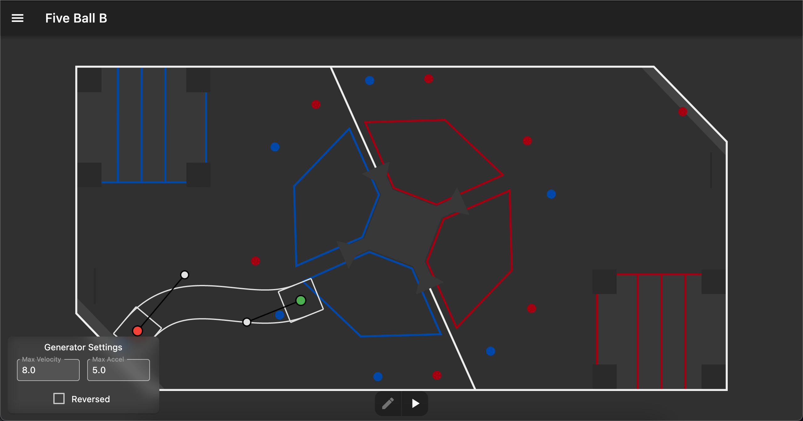

# Creating autonomous routines

## Initial file creation

With the WPILIB VSCode extension, right click on the `robot/commands/autonomous` folder, then click on `Create a new class/command`.

In the menu that pops up, choose `SequentialCommandGroup (New)`.

Name the autonomous something useful

It will generate some code similar to this:

```java
public class TestAutonomous extends SequentialCommandGroup {

  public TestAutonomous() {

    addCommands();
  }
}
```

Change the `extends` clause to extend `AutoBaseCommand` instead of `SequentialCommandGroup`

It will give errors upon doing this, as you need to implement the `generatePaths` method.

Copy the following code to the bottom of the autonomous class

```java
protected void generatePaths() {

}
```

The constructor will need to have all of the subsystems passed into it, so change it to be similar to the following

```java
public TestAutonomous(Drivetrain drivetrain, Shooter shooter, Intake intake, Magazine magazine, Climber climber, Limelight limelight) {
    super(drivetrain, shooter, intake, magazine, climber, limelight);
    addCommands(
        // Commands here
    );
};
```

> The `super` method will automatically set all of the subsystems to variables that are accessible from anywhere in the command.

## Creating the paths

In pathplanner, creating paths is extremely easy. The biggest thing to remember with it is that any time you need to stop and do something, that will need to be the end of a path. For example, our 5-ball auto is split into 3 different paths, each of which starts at the previous path's end position.

The images below represent this, with the end of the A path being the same spot as the beginning of the B path.




## Loading paths into code

Back in the code, each path needs to be loaded in. Each path can be represented by a `PPSwerveControllerCommand` object at the class level, so it's easy to grab on the fly.

```java
PPSwerveControllerCommand driveBackCommand;
```

In the `generatePaths` method, create a `PathPlannerTrajectory` object to load the path in, then convert it into a `PPSwerveControllerCommand` that is set to that class variable.

```java
// 6 represents the max speed m/s of the robot
// 4 represents the max acceleration m/s^2
PathPlannerTrajectory m_driveBack1 = PathPlanner.loadPath("TestAutonomous", 6, 4);

driveBackCommand = new PPSwerveControllerCommand(
        m_driveBack1,
        drivetrain::getPose2d,
        drivetrain.getKinematics(),
        m_translationController,
        m_strafeController,
        m_thetaController,
        drivetrain::setAllStates,
        drivetrain);
```

From here, in the `addCommands` call in the constructor, you can simply put the `PPSwerveControllerCommand` you created in there, and the robot will do it _automagically_.

Add an `InstantCommand` to set up the gyro and odometry. The `setGyroscope` method should match the angle of the first point in PathPlanner, and the `resetOdometry` method should have the position and rotation of the first point. This basically just tells the robot where it is, which is essential for proper path following.

```java
addCommands(
    new InstantCommand(() -> {
        drivetrain.setGyroscope(-21.10);
        drivetrain.resetOdometry(new Pose2d(6.10, 4.9,  Rotation2d.fromDegrees(-21.10)));
    }),
)
```

> THIS NEEDS TO BE DONE ANY TIME THE POINT IS CHANGED IN PATHPLANNER OR THINGS WILL BREAK

## Make the robot do things other than drive

This is arguably the hardest part about the autonomous creation process. The different types of command groups get quite confusing, especially with their names being very similar. Here's a quick rundown of what each of them do, and when they should be used.

### SequentialCommandGroup

This runs nothing at the same time. It quite literally just runs the commands one after another, continuing on once each command finishes. This is used frequently for running multiple swerve commands after another, or doing something in a set order.

### ParallelCommandGroup

This will run all commands at the same time, but not finish until all of the commands have also finished. This could be used for something like a climber if the arms were controlled by separate motors and limit switches. It would allow for each side to finish individually and the continue on with whatever the other commands are afterwards.

### ParallelDeadlineGroup

This is your bread and butter command for autonomous. Whatever the first command is in the group is considered the "deadline", meaning that when it finishes, so does the rest of the group. This is used extremely frequenly alongside pathplanner, where you can have the `PPSwerveControllerCommand` running, but also have the intake down, have the magazine automatically bump cargo to where it needs to, or anything else that should just be running alongside the drive command. As soon as the first command finishes, all the other commands inside will stop as well, giving you a clean slate to work from.

### ParallelRaceGroup

This is the thing that caused lots of grief early on in development. It is essentially the opposite of the `ParallelCommandGroup`, where if **ANY** of the commands in the group finish, the rest of them will be forced to stop. This caused issues where we thought PathPlanner was just being extremely inconsistent, but it was actually due to whether we had 2 cargo in our magazine, which was considered a stop point for the `MagazineAutoBump` command, which forced the drive commands and all the other ones in the group to finish as well.

> There are useful times to use this, but in most situations, I'd advise against it due to it causing issues that are not easily traced down.

## Useful commands

For the 2022 robot, we have a bunch of super helpful commands for making autonomous creation easy.

### `IntakeCargo`

```java
new IntakeCargo(intake, magazine)
```

In 99% of cases, this will be in a `ParallelDeadlineGroup` with the drive command and the `MagazineAutoBump` command. It simply puts down the intake and runs the intake motors until there are 2 pieces of cargo in the robot, in which it will lift it and stop all of the motors.

### `MagazineAutoBump`

```java
new MagazineAutoBump(magazine)
```

This will attempt to automatically bump cargo to the top of the magazine at all points, keeping the bottom of the magazine open for another cargo to come in. The below table shows the states of what the magazine will do in different ball situations. There are small speed adjustments that are made based on whether there is cargo in the upper magazine, but they are only there to ensure that a cargo isn't forced past the sensors. This command should be running pretty much all the time, except for when shooting, as that command handles it automatically.

| Cargo in upper | Cargo in lower | Upper motor | Lower motor |
| -------------- | -------------- | ----------- | ----------- |
| No             | No             | Running     | Running     |
| Yes            | No             | Not Running | Running     |
| No             | Yes            | Running     | Running     |
| Yes            | Yes            | Not Running | Not Running |

### LimelightAim

```java
new LimelightAim(drivetrain, limelight).withTimeout(1.5)
```

This command simply lines up the robot with the target using the Limelight. In 99% of cases, there should be a `.withTimeout()` clause attached to it, as that prevents it from just getting stuck with aiming forever. Typically after around a second, the robot is aimed properly anyway, so 1 second or 1.5 is the typical amount that should be used.

### LimelightShoot

```java
new LimelightShoot(shooter, magazine, limelight)
```

When the limelight is properly tuned for a field, this will automatically calculate the speed and hood angles and shoot a cargo from wherever you are on the field. We've been having issues with this, so `ManualShoot` has been being used instead lately.

### ManualShoot

```java
new ManualShoot(shooter, magazine, () -> 7000, () -> -7)
```

This is the backup shoot command, which sets the hood angle and shoots the cargo at a specific speed. The calling of this command requires `DoubleProvider`s to be passed in, but that can be done with a simple arrow function (`() -> 7000`). It will automatically wait until the shooter is up to speed, then bump the cargo into the flywheel, then move the next cargo to the top of the magazine to prepare for the next shot. This is what we started using when our limelight wasn't being consistent, which allowed for extremely accurate shots when mixed with good PathPlanner paths.

### InstantCommand

```java
new InstantCommand(() -> {
    shooter.runMotor(0);
    intake.setIntakeDown(false);
})
```

While not a custom command, this is one of the most versatile commands out there. It allows you to run any code inside it that will be run when the command is told to, so it's good for resetting things to proper states before doing other things. It's also essential at the start of the autonomous routine to set up the gyro angles for where the robot is positioned.
